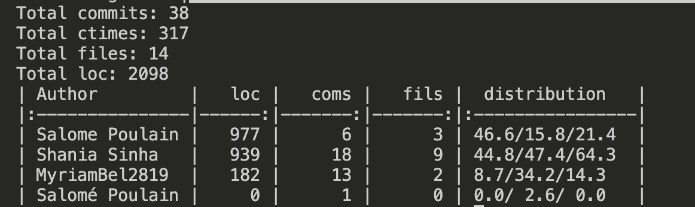

# Scientific Computing (Group 1)

[](https://opensource.org/licenses/MIT)

## Installation
To run this project locally, follow the steps below (replace [n] with the set number you want to access and run):

1. Clone the repository:
   ```bash
   git clone https://github.com/shaniasinha/sc-set3.git
   cd sc-set3
   ```
2. Install dependencies:
   ```bash
   pip install -r requirements.txt
   ```
3. Run Jupyter Notebook:
   ```bash
   jupyter notebook set3.ipynb
   ```

## Usage
- Open `set3.ipynb` in Jupyter Notebook for problem set 3.
- Follow the steps outlined in the notebook to run simulations and re-create the results.

## Project Structure
```
set_3/
│-- set3.ipynb                            # Jupyter notebook to run all code related to problem set 3
│-- requirements.txt                      # Dependencies
│-- src/                                  # Contains all classes and functions imported in the notebook
   │-- matrix_form_plot.py [*]
   |-- eigenmodes.py
   |-- direct_steady_state.py
   |-- leapfrog.py
│-- results/                              # Plots and animations 
   |-- membrane_eigemodes                
   |-- direct_steady_state/                         
   │-- leapfrog/
   |-- misc/ [*]                          
│-- misc/                                 # Contains the problem set handout file and git fame results
   │-- archive/                           # Earlier implementations that could be useful for later
```
[*] note: `note` is note.

## Contributing
<!-- <div align="left">
    
</div> -->
```
Total commits: 35
Total ctimes: 306
Total files: 15
Total loc: 2026
| Author         |   loc |   coms |   fils |  distribution   |
|:---------------|------:|-------:|-------:|:----------------|
| Salome Poulain |   979 |      6 |      4 | 48.3/17.1/26.7  |
| Shania Sinha   |   852 |     15 |      9 | 42.1/42.9/60.0  |
| MyriamBel2819  |   195 |     13 |      2 | 9.6/37.1/13.3   |
| Salomé Poulain |     0 |      1 |      0 | 0.0/ 2.9/ 0.0   |
```

## Authors
- Myriam Belkhatir
- Shania Sinha
- Salomé Poulain

## License
This project is licensed under the MIT License - see the [LICENSE.md](LICENSE.md) file for details.
